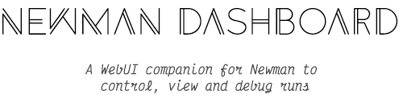

<p align="center">
    
</p>

<p align="center">
    
    
    
</p>

## About

Newman Dashboard aims to provide a real-time WebUI dashboard which can let you control and view the currently executing as well as the previously executed [newman](https://github.com/postmanlabs/newman) runs. This would help you debug and analyze your runs from a single endpoint and notify about any error which might occur during the run.

This project was built during [Google Summer of Code 2021](https://summerofcode.withgoogle.com/projects/#5547391014404096) ☀️ with [Postman](https://github.com/postmanlabs) 🚀

## Environment setup

A. Install all dependencies

```
npm install
```

B. Run the CLI for launching the dashboard

```
node ./bin/index <args>
```

C. Running the tests

```
// The complete test suite along with linting
npm test

// Only linting
npm run test:lint

// Only the test suite
npm run test:suite
```
