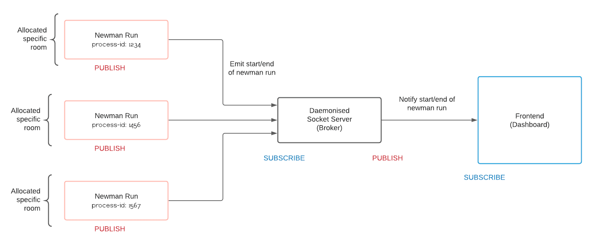
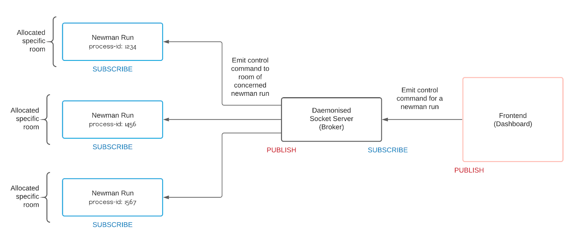

# Architecture

Newman Dashboard is a real-time reporter for Newman to control, view and debug runs on a WebUI dashboard.

## Core Concepts

We establish a pub/sub architecture between Newman and the WebUI(frontend) through a central server known as the broker. <br/>
The frontend and Newman never know about one another directly, they just connect to the broker as clients.<br/>
The broker pushes each of these clients into separate "rooms" to maintain abstraction and isolation between them i.e. every client should receive messages concerned with itself and no other client. <br/>

## Flow

### Connecting Newman to broker

For connecting Newman to the broker there are 2 prerequisites:

1. Dashboard should be started on `http://localhost:5001/` using the newman-dashboard CLI
2. `newman-dashboard` should have been provided as a reporter for that Newman run.

```
newman run <collection> -r dashboard
```

1. When this Newman run will execute, the reporter will try to connect to the broker at `http://localhost:5001/`.
2. Upon authentication, the broker will push this client to a specific room where it can receive events related to its underlying run.
3. Newman emits a `start` event on the actual start of the Newman run, this would be sent by the reporter to the broker. The broker would publish this to the frontend.
4. The frontend would then store this run's status and corresponding `id` in its local store and it would then be visible to the users.

### From Newman to WebUI

1. Newman emits an event regarding the state of an underlying run like `abort`, `start`, `pause` etc.
2. The reporter listens for events from Newman and publishes them to the broker along with the run `id` to identify this particular run.
3. The broker relays this message to all the frontend clients.
4. The frontend, upon receiving the message by the broker, changes the state of that particular Newman run (identified by its `id`) to what it issued to the broker.

Using sockets, this process is almost instantaneous with almost no lag.



### From WebUI to Newman

1. The user issues a command for a Newman run by clicking on any of the pause, abort or resume buttons.
2. The frontend publishes this request to the broker.
3. The daemon relays this to the reporter corresponding to the provided `id`.
4. The reporter emits the event to Newman to `pause`, `abort` or `start` the run.


